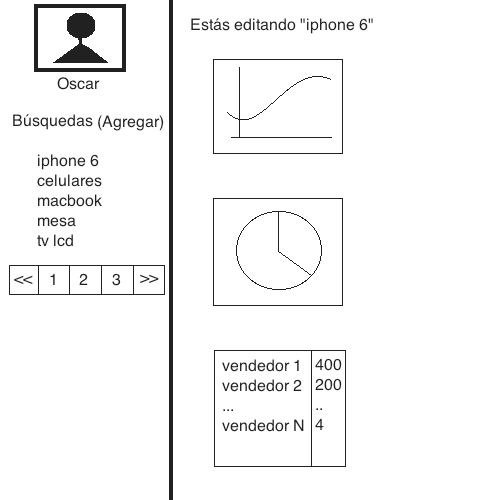

Ejercicio

Este ejercicio consiste en hacer una pequeña aplicación web con el objetivo de evaluar conocimientos, capacidad de aprender y priorizar.

Se pueden hacer consultas en todo momento por e-mail.

La aplicación a construir es un mini Analytics sobre búsquedas en MercadoLibre con las siguientes funcionalidades.

Tu objetivo es conseguir la mayor cantidad de puntos en la menor cantidad de días.

Requerimientos funcionales:
		
		5000 puntos - Poder agregar búsquedas, guardar, eliminar y listar mis búsquedas (ej: "ipod", "celulares", ...)

		1000 puntos - Por cada información / insight sobre la búsqueda que estoy viendo
						
						Ejemplos:
							número de vendedores distintos en la primera página
							histograma ventas por usuario
							pie chart con oferta en tiendas oficiales vs oferta total
							line chart con precios promedio por página en las primeras x págs
							... (cualquier indicador razonablemente útil es válido)

					* Mínimo: 3 indicadores

		3000 puntos - Interfaz con Bootstrap

		1000 puntos - Login
		
		2000 puntos - Login con Facebook (reemplaza al anterior)
		
		3000 puntos - Storage de las queries en una base de datos

		4000 puntos - Storage de los indicadores en la base de datos

		2000 puntos - Caché entre la webapp y el storage

Requerimientos tecnológicos:

	- Deploy en el free tier de Amazon

	- Utilizando algún framework web JVM-based (Play, Grails, Java) o NodeJS (Javascript)

Esquema de ejemplo de la interfaz:

